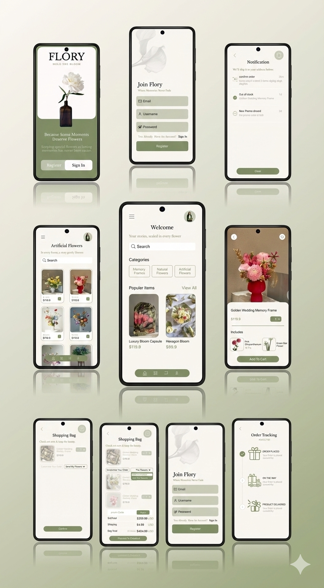

# Flory App

Flory is a Flutter app for preserving flowers in artistic frames, turning memories into lasting keepsakes.
Built with Flutter & Firebase, following clean code practices and supporting dark mode for a better user experience.

## Tech Stack
Flutter • Dart • Firebase (Auth, Firestore, Storage) • State Management
## Features
•Authentication
•Product Browsing
•Cart & Favorites
•Order Tracking
•Dark Mode
•Responsive UI

  

